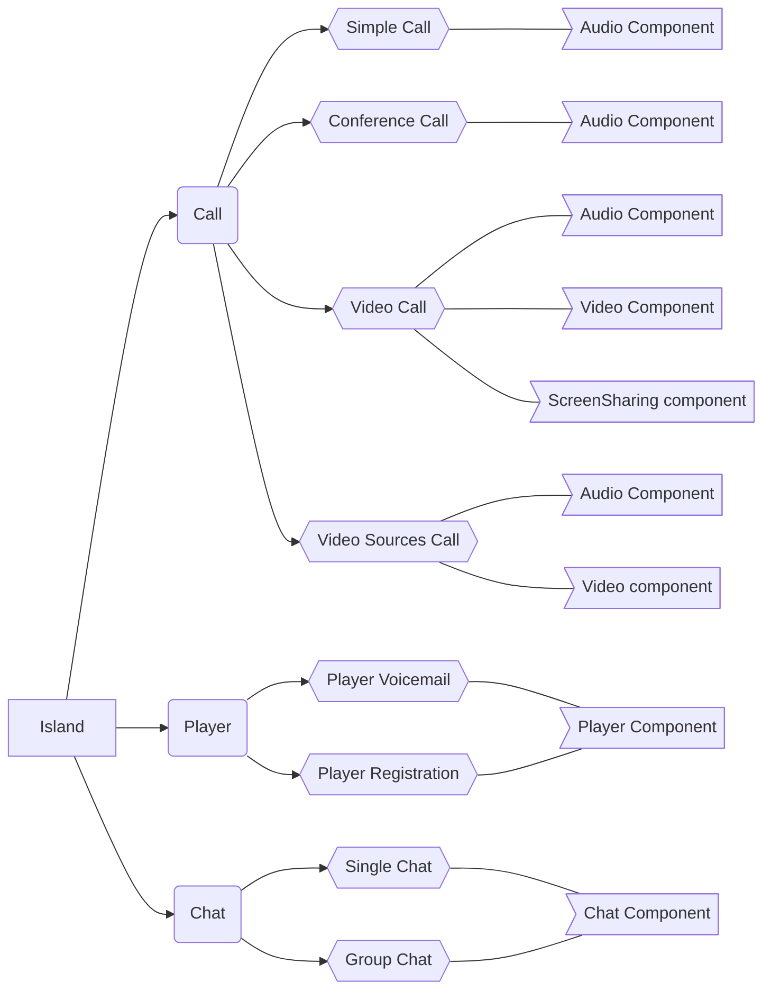

# NethVoice CTI Phone Island

A fully standalone component for managing calls, video calls, screen sharing and more...

## Builds

Available as component on `npm`

[](https://www.npmjs.com/package/@nethesis/phone-island)

Available as widget on `jsDelivr`

[](https://cdn.jsdelivr.net/gh/nethesis/phone-island/dist-widget/index.widget.js)
[](https://cdn.jsdelivr.net/gh/nethesis/phone-island/dist-widget/index.widget.css)

## Screenshots

### Dark Theme
#### Call started


#### Call incoming


#### Call connected


### Light Theme
#### Call started


#### Call incoming


#### Call connected


## Structure



## Scaffolding

- **widget-build** - contains the build of the widget version
- **widget-example** - contains the usage example of the built widget
- **dist** - contains the component lib build
- **src/index.ts** - is the entry point for the component lib and exports the React component
- **src/index.widget.tsx** - is the entry point for the widget that is built as a single js and css file

## Development

Install deps

```
npm install
```

Run Storybook

```
touch .env.development.local
echo "CONFIG_TOKEN=$(echo -n "<cti_host>:<cti_username>:<cti_token>:<sip_ext>:<sip_secret>" | base64 -w0)" > .env.development.local
npm run dev
```
**Other environment variables can be specified inside the file above:**

```
# The destination number to be called
DEST_NUMBER=<call_destination_number>

# The announcement id to be reproduced as announcement and base64 audio file
ANNOUNCEMENT_ID=<announcement_id>

# The call recording id to be reproduced
CALL_RECORDING_ID=<call_recording_id>
```

The main component can be developed using Storybook. Inside the story is rendered the component exported by the final component library.

Tailwind CSS is enable by default.

## Import locally

Run build and start watch

```
npm run watch
```

Go to the project directory

```
cd <local-project>
```

Link the `./dist` directory

```
npm link <path-to-phone-island/dist>
```

## Build

Build component library

```
npm run build
```

Build widget

```
npm run build:widget
```

Serve the widget

```
npm run serve:widget
```

As you can see the app/component can be built in two ways.

- The component library built with Rollup
- The widget files built with Parcel
