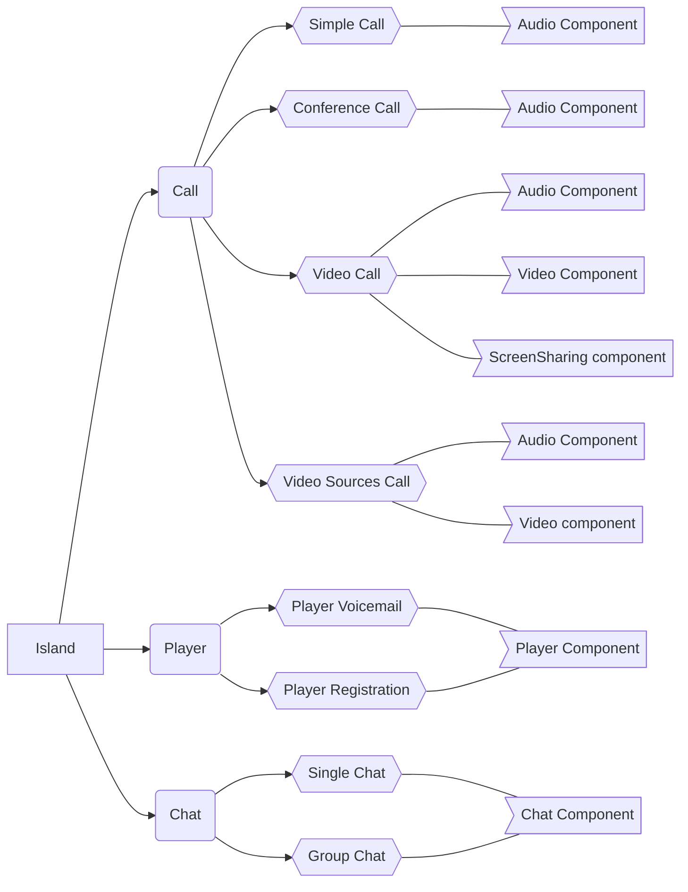

# NethVoice CTI Phone Island

A fully standalone component for managing calls, video calls, screen sharing and more...

## Builds

Available as component on `npm`

[](https://www.npmjs.com/package/@nethesis/phone-island)

Available as widget on `jsDelivr`

[](https://cdn.jsdelivr.net/gh/nethesis/phone-island/dist-widget/index.widget.js)
[](https://cdn.jsdelivr.net/gh/nethesis/phone-island/dist-widget/index.widget.css)

## Integrate in any template

Phone Island can be embedded in any HTML template, CMS page or server-rendered application without a React-specific integration.

To embed the standalone widget you need:

1. the CDN CSS file
2. the CDN JavaScript bundle
3. a container element with class `phone-island`
4. a Base64 config token in `data-config`
5. a host-side JavaScript file that dispatches commands and listens to Phone Island browser events

### Minimal HTML example

```html
<!doctype html>
<html lang="en">
    <head>
        <meta charset="utf-8" />
        <meta name="viewport" content="width=device-width, initial-scale=1" />
        <title>Phone Island integration</title>

        <link
            rel="stylesheet"
            href="https://cdn.jsdelivr.net/gh/nethesis/phone-island@latest/dist-widget/index.widget.css"
        />
    </head>
    <body>
        <div class="phone-island" data-config="YOUR_BASE64_CONFIG_TOKEN"></div>

        <script src="https://cdn.jsdelivr.net/gh/nethesis/phone-island@latest/dist-widget/index.widget.js"></script>
        <script src="./phone-island-integration.js"></script>
    </body>
</html>
```

### Host-side integration script

Create a file such as `phone-island-integration.js` and use it to control the widget from your page.

```javascript
function dispatchPhoneIslandEvent(eventName, detail = {}) {
    window.dispatchEvent(new CustomEvent(eventName, { detail }))
}

window.addEventListener('phone-island-call-started', (event) => {
    console.log('Call started', event.detail)
})

window.addEventListener('phone-island-video-call-started', (event) => {
    console.log('Video call started', event.detail)
})

document.getElementById('call-200')?.addEventListener('click', () => {
    dispatchPhoneIslandEvent('phone-island-call-start', { number: '200' })
})
```

### Base64 config token

The standalone widget expects a Base64 string in this format:

```text
<cti_host>:<cti_username>:<cti_token>:<sip_ext>:<sip_secret>:<sip_host>:<sip_port>
```

Example generation:

```sh
echo -n "<cti_host>:<cti_username>:<cti_token>:<sip_ext>:<sip_secret>:<sip_host>:<sip_port>" | base64 -w0
```

### Full example

For a complete browser integration example, including event log, device switching, toast notifications and debug actions, see:

1. `widget-example/index.html`
2. `widget-example/index.js`

## Online Demo

The repository root now contains a demo entrypoint for GitHub Pages.
The page loads the standalone widget bundle from `dist-widget` so users can try Phone Island directly in the browser without integrating it into their own project first.

To publish or update the demo page:

```sh
npm install
npm run build:widget
```

Then publish GitHub Pages from the repository root so that at least these assets are available online:

- `index.html`
- `dist-widget/index.widget.js`
- `dist-widget/index.widget.css`

GitHub Pages should be configured to serve the root of the branch, because the demo page references the widget bundle with `/dist-widget/...` paths.

What users need to do on the demo page:

1. Open the GitHub Pages URL.
2. Paste a valid Base64 token built from `<cti_host>:<cti_username>:<cti_token>:<sip_ext>:<sip_secret>`.
3. Allow browser permissions for microphone and, if needed, camera.
4. Wait for the WebRTC registration to complete.
5. Start a test call from the page.

Notes:

- GitHub Pages is served over HTTPS, which is required for browser media permissions and WebRTC APIs.
- The demo is meant for testing the standalone widget build, not for production embedding.
- Every time the widget changes, `dist-widget` should be rebuilt before updating the Pages site.

## Screenshots

### Dark Theme
#### Call started


#### Call incoming


#### Call connected


### Light Theme
#### Call started


#### Call incoming


#### Call connected


## Structure


```mermaid
flowchart LR
    Views[Island] --> Call(Call)
    Views[Island] --> Play(Player)
    Views[Island] --> Chat(Chat)

    Call --> CC{{Simple Call}} --- 1CAComp>Audio Component]
    Call --> CCC{{Conference Call}} --- 2CAComp>Audio Component]

    Call --> CVC{{Video Call}}
    CVC{{Video Call}} --- 3CAComp>Audio Component]
    CVC{{Video Call}} --- 3CVComp>Video Component]
    CVC{{Video Call}} --- 5CVComp>ScreenSharing component]

    Call --> CVS{{Video Sources Call}}
    CVS{{Video Sources Call}} --- 4CAComp>Audio Component]
    CVS{{Video Sources Call}} --- 4CVComp>Video component]

    Play --> PA{{Player Voicemail}} --- 6PComp>Player Component]
    Play --> PR{{Player Registration}} --- 6PComp>Player Component]

    Chat --> CS{{Single Chat}} --- 7CComp>Chat Component]
    Chat --> CG{{Group Chat}} --- 7CComp>Chat Component]
```

## Scaffolding

- **widget-build** - contains the build of the widget version
- **widget-example** - contains the usage example of the built widget
- **index.html** - GitHub Pages demo entrypoint that loads the standalone widget from `dist-widget`
- **dist** - contains the component lib build
- **src/index.ts** - is the entry point for the component lib and exports the React component
- **src/index.widget.tsx** - is the entry point for the widget that is built as a single js and css file

## Development

Install deps

```
npm install
```

Run the local development host

```
npm run dev
```

Open the local page served by Parcel and paste the base64 config token in the left panel.

`npm run dev` generates an ignored local host from `widget-example/index.html` and replaces only the asset loading strategy for the dev session. The public integration page stays unchanged, while the local host imports `src/index.widget.tsx` and `widget-example/index.js` directly so edits in `src/App.tsx` and child components are reflected with live reload.

Example token generation:

```
echo -n "<cti_host>:<cti_username>:<cti_token>:<sip_ext>:<sip_secret>:<sip_host>:<sip_port>" | base64 -w0
```

Tailwind CSS is enable by default.

## Import locally

Run build and start watch

```
npm run watch
```

Go to the project directory

```
cd <local-project>
```

Link the `./dist` directory

```
npm link <path-to-phone-island/dist>
```

## Build

Build component library

```
npm run build
```

Build widget

```
npm run build:widget
```

Serve the widget

```
npm run serve:widget
```

As you can see the app/component can be built in two ways.

- The component library built with Rollup
- The widget files built with Parcel

```
npm run build-pack
```

It's useful to create a new local version of phone-island that could be imported in any project with some debug command

```
npm run revert-bump
```

It's useful to delete all .tgz created with npm run build-pack command, and reset git version to the original one
